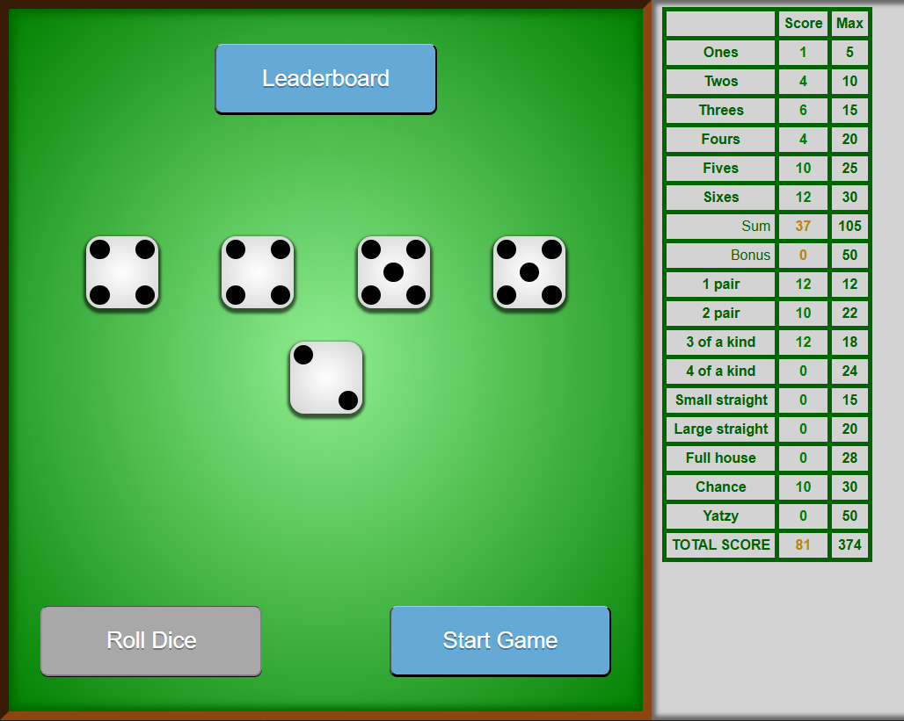
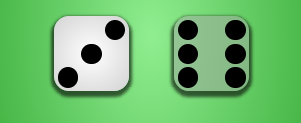
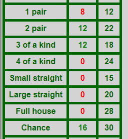
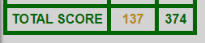

# Student's Yatzy

[Yatzy](https://wikipedia.org/wiki/Yatzy) is a dice game. This was made in HTML, CSS, and JS.

## How to Play

The game has two buttons: a button to roll dice, and a button to restart the game.
* Roll Dice: Rolls 5 dice, and reroll unselected dice up to 2 times.
* Start Game: Restarts the game. All progress will be lost!

After rolling the dice, you can click on a die to select which die to keep when you reroll the dice. The selected die will appear darker:

You can also click on a score box once you've rolled the dice. The score box in red is clickable and shows the calculated score associated with your current dice. Once you click it, you've put the score in the score box, which turns green, and you get a new turn to roll the dice again.

Once all of the score boxes have been filled (all turn green), the game is over and you will be shown the total score in gold color at the bottom of the scoreboard. You can only restart the game at this point.

For more information about the game, see the [Design System](/docs/design_system.md).